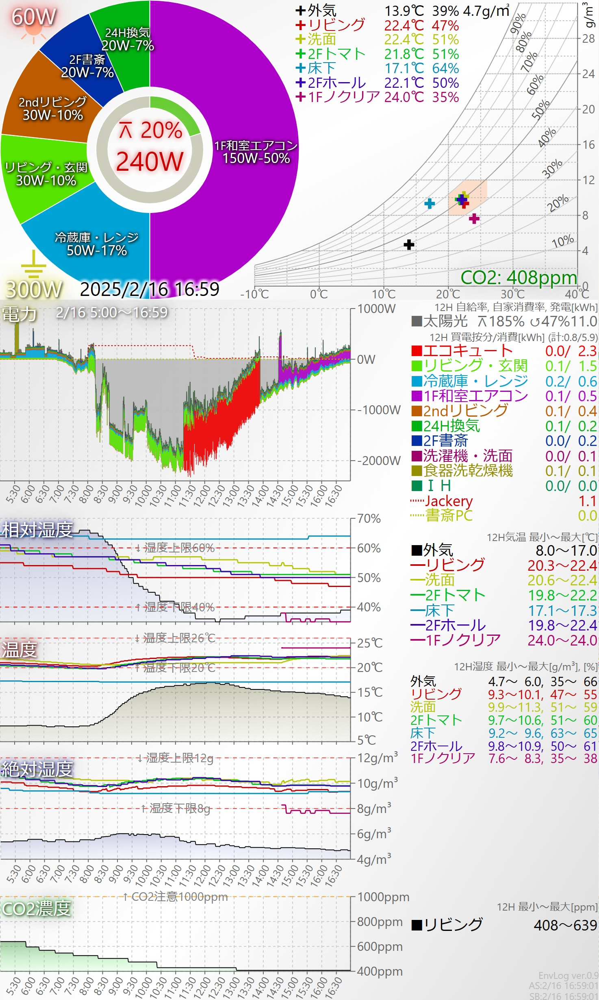

# 1. 個別設定ファイルの編集
## 対象ファイル
public(dist)フォルダのファイルの内、名前の先頭が「@」の以下ファイルが個別設定対象です。

・@device.json<br/>
・@httpauth.json<br/>
・@go<br/>

各ファイル内をカスタマイズ後に、ファイル名の先頭「@」を外してください。

・@device.json   → device.json<br/>
・@httpauth.json → httpauth.json<br/>
・@go            → go<br/>

それぞれの設定の詳細は以下項を確認してください。

## @device.json

収集対象のデバイス情報を設定します。

### AiSEG2(HEMS)設定
"aiseg2"キーのオブジェクトに設定を記載します。

・AiSEG2(HEMS)アドレス、ログインパスワード<br/>
```
　"addr":	"192.168.0.216",
　"sec":	["aiseg","***YourPassword***"],
```
"addr"にローカルに置いたAiSEG2のIPアドレスを設定します。
AiSEG2はデフォルトで192.168.0.216が割り当てられています。
もし変更された場合は、設定したIPアドレスを設定してください。

"sec"にPCからAiSEG情報を見るときのID/PASSを設定します。
AiSEG2のログインユーザはデフォルトで"aiseg"です。
もし変更された場合は、ユーザ名を設定してください。
パスワードは、AiSEG2本体側面または取扱説明書の裏表紙に記載されています。
こちらを設定してください。

グラフ上には、AiSEGから取得した回路名(消費電力を表示)や空調機器名(温湿度を表示)が表示されます。
回路名は全角7文字以下(半角14文字以下)を推奨します。
空調機器名は全角5文字以下(半角10文字以下)を推奨します。
(これより長いとグラフ上で文字が重なる場合があります)
これらの名前は、AiSEGメニューの「設定」-「かんたん施工」-「3.計測回路名称」、および「4.機器名称」で変更できます。

### SwitchBotデバイスリスト
以下例のように、4項目をデバイスの数だけ設定します。<br/>
```
		{
			"key":	"plug1",           ※グラフ表示時のソート順序のキーになります。
			"name":	"書斎PC",           ※グラフに表示されるデバイス名を定義します。
			"addr":	"34:85:**:**:**:**",※対象BotのBluetoothアドレスを設定します。
			"type":	106                 ※対象Botのデバイスタイプを設定します。
		}
```
keyはグラフの凡例の表示順序を決定します。(文字列の昇順に凡例が表示されます)

nameはグラフの凡例に表示されます。全角5文字以下(半角10文字以下)を推奨します。

addrは、SwitchBotのスマホアプリの各デバイスの「デバイス情報」を開くと
「BLE MAC」欄に表示されます。A-Fは小文字(a-f)で入力してください。

typeの数値については、SwitchBot社の公式ページを参照してください。
https://github.com/OpenWonderLabs/SwitchBotAPI-BLE<br/>
※公式ページでは16進数で記載されていますが、JSON設定では10進数で設定します。

例：
- 53 SwitchBot CO2センサー（温湿度計）
- 84 SwitchBot 温湿度計
- 100 SwitchBot 開閉センサー
- 105 SwitchBot 温湿度計プラス
- 106 SwitchBot プラグミニ（JP）
- 117 SwitchBot スマート電球 E26
- 119 SwitchBot 防水温湿度計

※高度な操作<br/>
スマホにSwitchBotアプリをインストールしていない場合、ダミーのデバイスを登録した状態でSwitchbot.pyを実行することで、ログから周辺のBotのBLEアドレスやタイプを確認することができます。
未登録のBLEアドレスが見つかるとログに「Unknown addr XX:XX...」と表示されます。
これをメモしてaddr設定に利用することができます。設定したtypeが実際のBotと異なると、"Device type mismatch 実際のタイプ(HEX)!=設定したタイプ(HEX) (addr)" と表示されます。これをメモして、正しいtypeを設定することができます。
(隣近所のSwitchBotデバイスが見つかることもありますので、ご注意ください)


## @httpauth.json

Webサーバにアクセスする時のログインパスワードを設定します。
local環境のみで使う場合は認証が無くてもセキュリティ上の問題は発生しませんが、ngrokで外からアクセスすることを考慮してパスワードを設定してください。

## @go
Webサーバを実行するための簡単なシェルスクリプトです。
2行目でngrokクライアントを実行しています。
```
・nohup ngrok http --url=***YourDomain***.ngrok-free.app 8080 &
```
上記の「***YourDomain***」に、ngrokから取得したドメインを設定してください。

※ローカル環境のみで使用し外出時に参照不要な場合はngrokを使う必要はありません。
　この場合は、以下コマンドでサーバを起動できます。
```
　% nohup python webapp.py > webapp.log  &
```

# 2. インストール
distフォルダのファイルを、前述1項で編集した個別設定ファイルごと、SCPなどでサーバ(Raspberry Pi Zero 2 W等)に送ります。
その後、サーバで以下を実行することでサービスが開始します。

# 3. サーバ起動

```
% bash go
```
goは以下のシェルスクリプトです
```
 % nohup python webapp.py > webapp.log  &
 % nohup ngrok http --url=***YourDomain***.ngrok-free.app 8080 &
 ```
※ローカルネットワークのみで使用する場合は、以下の実行で構いません。
```
 % nohup python webapp.py > webapp.log  &
```

# 4. Webアプリ起動

ウェブブラウザでサーバのアドレス:ポートを指定してアクセスすることで、情報を確認することができるようになります。

# 5. PWA登録
Webアプリをスマホアプリのように使えるPWA（プログレッシブウェブアプリ）は、HTTPSのWebアプリしか登録できません。
本プロジェクトのWebAPPはHTTPで動作しますが、ngrokを用いることでHTTPS化ができます。
このため、ngrok経由でwebページを開くことで、スマホにEnvLogVをインストールすることができます。
（Android:ブラウザのメニューから「ホーム画面に追加」）
PWAで動作させると、全画面表示されます。
ステータスバーを含めてフルスクリーンにする場合はmanifest.jsonを変更してください。
- "display": "standalone",<br/>
　　　↓
- "display": "fullscreen",

Screenshot (Portrait)
